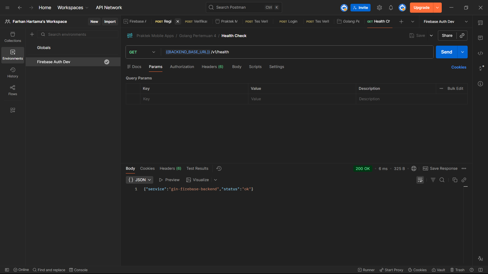
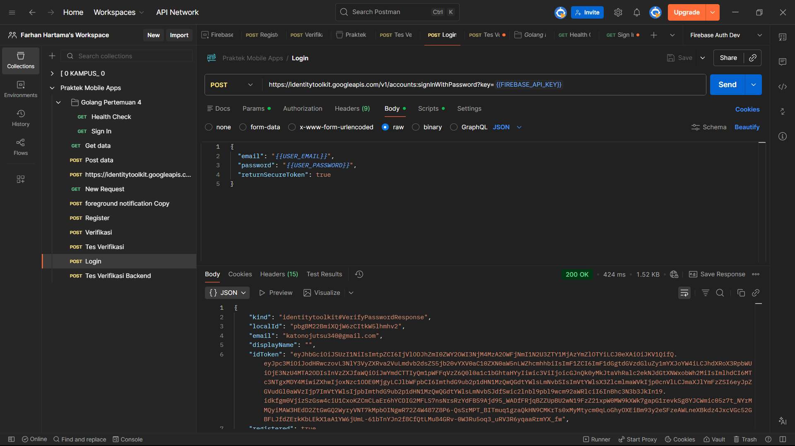
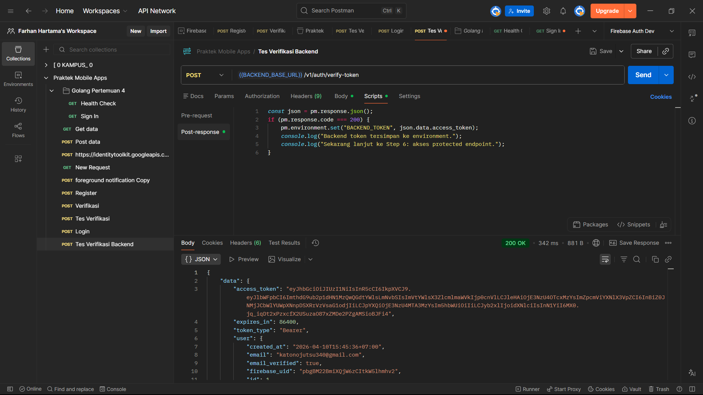
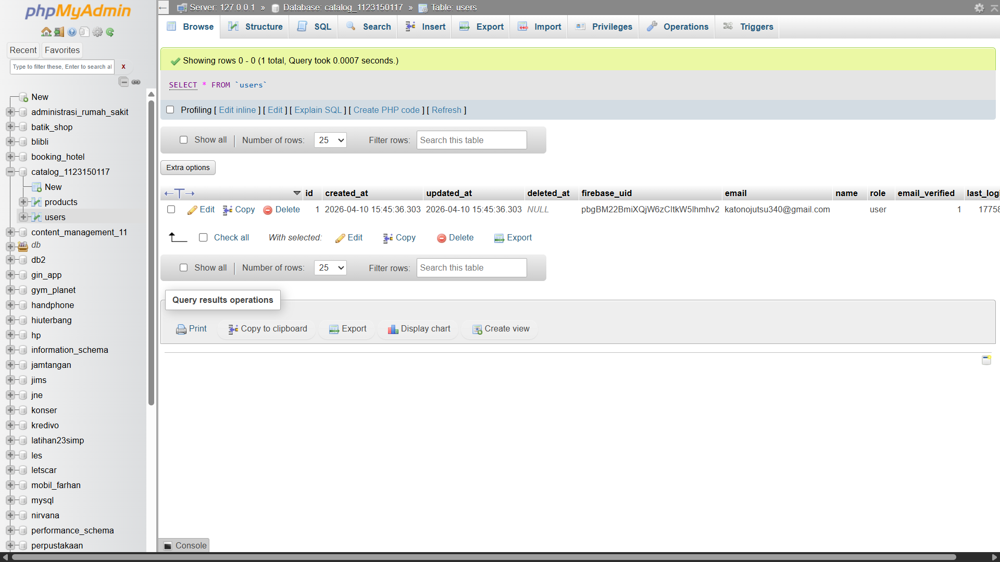
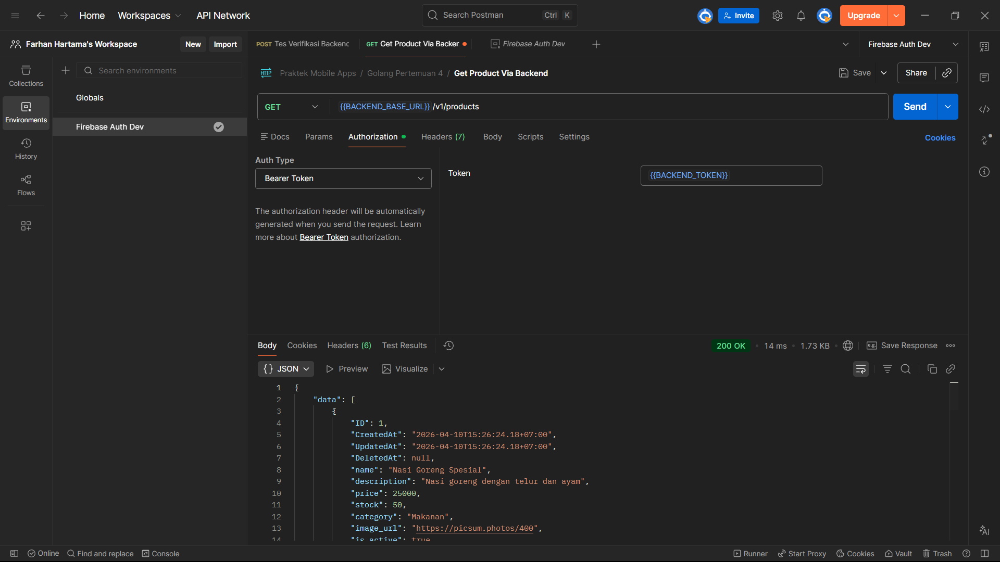
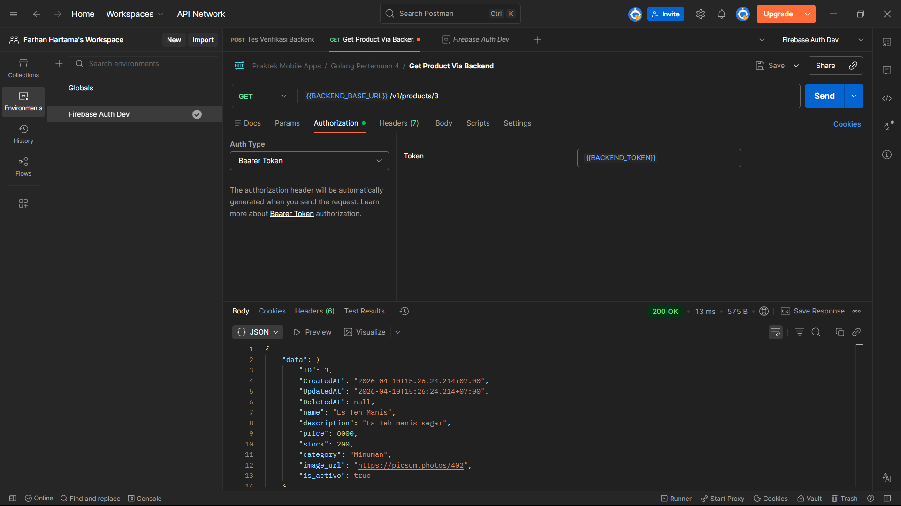
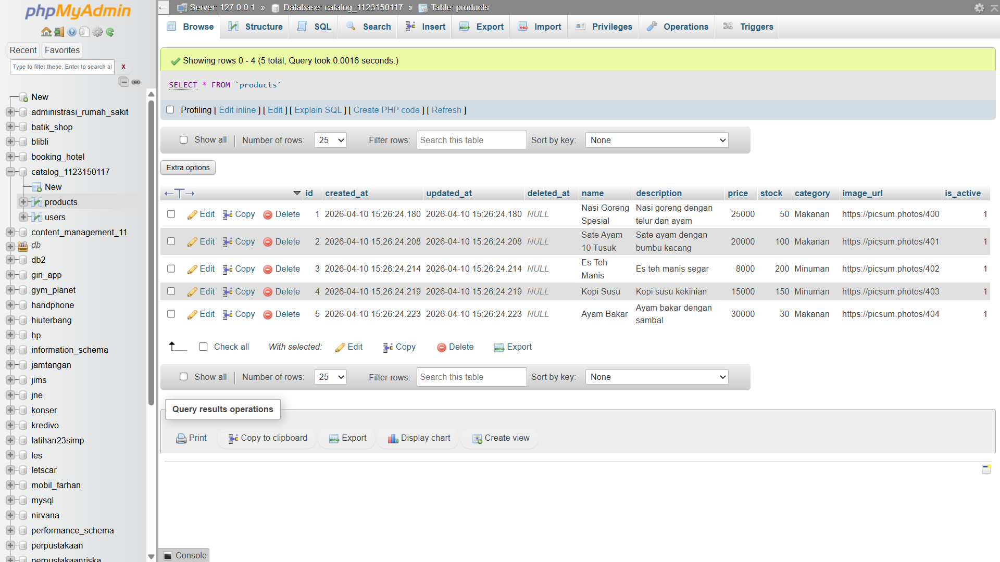
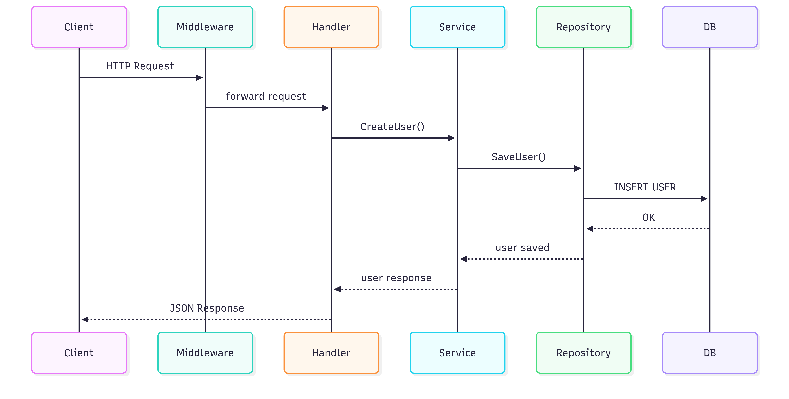
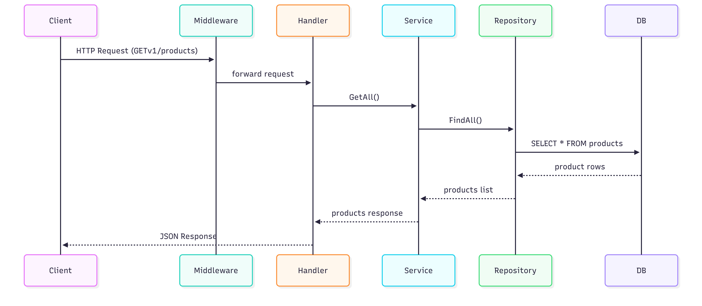
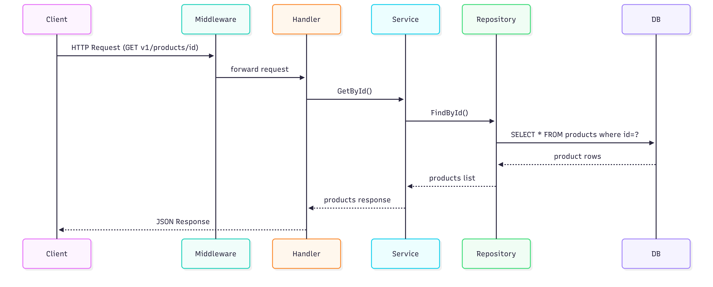

# Testing Endpoint


### Health Check menggunakan Backend URL (http://localhost:8081)
- Endpoint
```bash
GET

{{BACKEND_BASE_URL}}/v1/health

```

### Example



---

### Login untuk mendapatkan idToken


- Endpoint
```bash
POST

https://identitytoolkit.googleapis.com/v1/accounts:signInWithPassword?key={{FIREBASE_API_KEY}}
```

### Example



---

### Verifiy Token menggunakan idToken untuk mendapatkan accessToken.
#### Note: Pastikan bahwa akun sudah mendapatkan pesan verifikasi via email ketika registrasi (daftar akun)
#### Setelah tahap ini, data user akan masuk ke database
- Endpoint
```bash
POST

{{BACKEND_BASE_URL}}/v1/auth/verify-token
```


### Example



---

### Get All Product menggunakan accessToken
- Endpoint
```bash
GET

{{BACKEND_BASE_URL}}/v1/products
```

### Example



---

### Get Product By id menggunakan accessToken
- Endpoint
```bash
GET

{{BACKEND_BASE_URL}}/v1/products/4
```

### Example



---

# Seeder

- Command Running Seed
```bash
go run seeds/seed.go
```

### Setelah di run



---

# Flow (Sequence Diagram)

### Create User



### Code
```bash
sequenceDiagram
participant Client
participant Middleware
participant Handler
participant Service
participant Repository
participant DB
Client->>Middleware: HTTP Request
Middleware->>Handler: forward request
Handler->>Service: CreateUser()
Service->>Repository: SaveUser()
Repository->>DB: INSERT USER
DB-->>Repository: OK
Repository-->>Service: user saved
Service-->>Handler: user response
Handler-->>Client: JSON Response
```

# Get All Product



### Code

```bash
sequenceDiagram
participant Client
participant Middleware
participant Handler
participant Service
participant Repository
participant DB

Client->>Middleware: HTTP Request (Get v1/products)
Middleware->>Handler: forward request
Handler->>Service: GetAll
Service->>Repository: FindAll
Repository->>DB: SELECT * FROM products
DB-->>Repository: product rows
Repository-->>Service: products list
Service-->>Handler: products response
Handler-->>Client: JSON Response
```

# Get Product by Id



### Code

```bash
sequenceDiagram
participant Client
participant Middleware
participant Handler
participant Service
participant Repository
participant DB

Client->>Middleware: HTTP Request (Get v1/products/id)
Middleware->>Handler: forward request
Handler->>Service: GetById
Service->>Repository: FindById
Repository->>DB: SELECT * FROM products where id=?
DB-->>Repository: product rows
Repository-->>Service: products list
Service-->>Handler: products response
Handler-->>Client: JSON Response
```